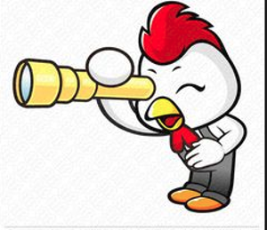

## A Convenient Heuristic


Design patterns are essentially prepackaged, general purpose solutions that can be applied to solve common problems that frequently crop up in the design of complex software systems. Design patterns have been claimed to enable rookie coders to harness the powers of the infamous hacker ninja! However, the concept of design patterns is far from a trivial one, which is why I have decided to leave it up to the chickens to elaborate on the intricacies of this subject. The biological life history of any jungle fowl can be summarized into three broad topics: creation, structure and behavior.

## Creation


The start of any great story begins with creation, and chickens are surely no exception to this. Sometimes, we want to be able to go off and manufacture a diverse array of chickens, without getting bogged down by the details of how to actually create each individual hen or rooster.

When placed in the precarious position of needing to produce a potpourri of poultry-perfection, one should surely leave it up to a factory to yield the desired products. The primary benefit of delegating the creation of chickens to a factory, is that the factory is essentially capable of creating any quantity, and any type of chicken you could imagine, such as the majestic “honor your ancestors chicken.” He is still a chickens, and yet so much more.

<figure>

  <figcaption style="text-align: center"><em>In case you were wondering, chicken actually inherits from dinosaur</em></figcaption>
</figure>


On the other hand, we may instead find ourselves requiring a solitary exemplar of avian majesty, the ownership of which lies not in the hands of any single chicken tender, but whose glory is instead made available to the entire globe of poultry practicioners upon which it stands, to be gazed upon in awe and wonder. In this case, look no further than the magnificent “singleton chicken!” After all, what good is it to have a multitude of sub-par chickens, when we can have a single chicken that suits our needs better than all of the rest?

## Structure

While chickens certainly exhibit a highly predictable bodily structure, with feathers, wings, a beak, and talons, there is much that we can do to elaborate on this seemingly mundane phenotype. Are you a bored bird shepherd, looking to add some variety to your flock? Instead of investing precious time and scarce resources in a new group of Galliforms, enlist the aid of the “decorator chicken!” The decorator chicken has the just the right touch of creativity to help each of your chickens learn new behavior, find a new purpose, and gain a new lease on life. 

## Behavior


Many people falsely believe that chicken behavior is a dry, boring subject. Those people are completely unaware of the existence of the elusive and daring “observer chicken!” When danger is lurking just outside of the hen house, the observer chicken is able to notify his fellow chickens who depend upon him to alert them of potential risks, so that they may respond accordingly. The observer chicken is truly  an exemplar of the complex behavior that these seemingly mundane organisms can exhibit.

## An Author’s Forays into the Fowlery

During my time as a lead developer on the Shaka Scheme project, I was presented with many opportunities to leverage a few of the aforementioned design patterns to aid me in tending to my flock. At one point, I discovered that I required a means by which to ensure that the resources devoted to the creation of each chicken would eventually be recycled, without needing to manage the gruesome task myself. In accomplishing this, I leveraged a special instance of the factory pattern to ensure that any expired or unneeded chickens would be dealt with accordingly.  Enter the “garbage collector chicken!” Just kidding, here come code examples illustrating what I found to be an interesting use case of the factory pattern.

``` c++
/** Implements the internal heap allocated memory 
 * object managed by class GC */
class GCData {
  friend class GC;
  private:
  GCData(const Data& data);
};
```

The GCData class has a private constructor, so GCData objects cannot be constructed directly. Instead, one must use the factory `GC` class to create heap allocated objects.

``` c++
/** Implements the garbage collector factory
 *  and memory manager object */
class GC {
  public:
  GCData *create_data(const Data& data) {
    GCData *gcd = new GCData(data);
    this->list.add_data(gcd);
    return gcd;
  }
  private:
  GCList list; // The collection of managed memory objects
};
```

The `GC` object holds an internal collection of pointers to the heap allocated `GCData` objects so that these objects can always be accessed by the language implementation, and deallocated if they are no longer referenced by the language runtime.
    
What arose from this design turned out to be a compact and uniform means of creating heap allocated objects, and having their resources managed by the Garbage Collector by default. A potential improvement to this design could have been to set up the Garbage Collector as a singleton, so that only a single instance of the `GC` class could exist in the runtime system at a given time. In summary, I believe that design patterns can serve to ease the cognitive burden involved in designing complex systems, enabling programmers to translate their ideas into code more readily than they would otherwise be able to if they were forced to always come up with a new design on their own. Don’t believe me? Just ask the chickens!
