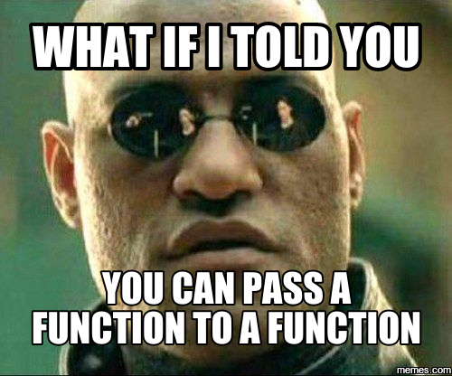

## Humble Beginnings

My journey as a software engineer and developer began unassumingly enough. As a young and inexperienced lab technician at the Hawaii Cooperative Fishery Research Unit, I began to grow weary of spending day after day sawing away furiously at dead groupers, leaving the lab covered in scales and fish offal. Somehow, I had imagined that life as a marine biologist would be more glamorous than this.

I found solace in performing data analysis utilizing the R programming language and statistical environment. I was mesmerized by how a simple series of text based commands could compel the computer to produce elaborate charts and figures. I wondered, “what else could I do with this newfound craft of programming?”

## Down the Rabbit Hole

As it turns out, you can get computers to do a plethora of amazing things by sitting down and writing some code. As an avid gamer, I settled on the idea of developing the next successful indie game. To say that this was easier said than done would be an understatement. After a few quick Google queries, I discovered that I would need to learn C++, as that seemed to be the language of choice in the game development industry. 

As a complete newbie, C++ turned out to be an incredibly unforgiving language, and I felt discouraged by my inability to grasp some of the quirkier concepts of the language, such as pointers and templates. Additionally, the concept of object-oriented programming was completely over my head at this point. Any dream of implementing my own game that other people would feel excited to play felt thousands of miles away.

## Back to Basics

If I was going to become a competent enough programmer, able to develop complicated programs such as games, I needed to start with something simple. I initially chose the Python programming language, after reading numerous recommendations citing its merits as a beginner’s language. Python was certainly much easier for my callow eyes to grok than C++, yet I found that my code was still somehow plagued with frustrating syntax errors. Unsatisfied by my brief excursion in Python, I began to explore the vast  ecosystem of programming languages, searching for a suitable candidate. 

## A Programming Language Polyglot

What was intended to be a brief inquiry quickly developed into a long term obsession. I was enamored by the seemingly endless variety of programming languages available to the would be programmer. Over the course of 7 years, I bounced between Ruby, Java, Perl, C, Prolog, Pascal, Ada, Common Lisp, Scheme, Haskell, Standard ML, and even occasionally revisited Python and C++. I discovered an affinity for the functional programming languages such as Haskell and Standard ML, as these languages possess high level language constructs such as algebraic data types, first class functions, and pattern matching that I found to be both mind bending and aesthetically pleasing. As an unfortunate byproduct of my sort of “language attention deficit,” I spent more time sampling the different languages than I did composing complex programs in any one language. If I was to become an accomplished software developer, I needed to find a way to narrow my focus.

## Building a Foundation

I decided that the best way to re-approach the field of computer science from first principles would be to head back to school, which brings me to the current point in my journey. I have been enrolled in the B.S. in ICS program here at UH Manoa for two, going on three semesters now. During this time, I have been solidifying my knowledge of the basics of theoretical and applied computer science, with the goal of transitioning into a master’s degree program. I have also been blessed with the opportunity to participate in a project to develop an implementation of the Scheme programming language, which happens to be my favorite language of all. Coming back to school has turned out to be a positive experience, and I feel that my skills as a software developer have improved exponentially in this relatively short amount of time.

## Facing the Future

In the future, I hope to find creative ways to blend my background as a biologist, enthusiasm for  programming languages and theory, and passion for software development together. I am looking forward to learning full stack development in MeteorJS this semester in ICS 314. Web development is a domain that I have had little to no prior exposure to, so I am looking forward to acquiring a new set of skills. My hope is that I will develop a modicum of good taste, intuition, and creative vision that will enable me to produce large scale applications that solve real world issues.
