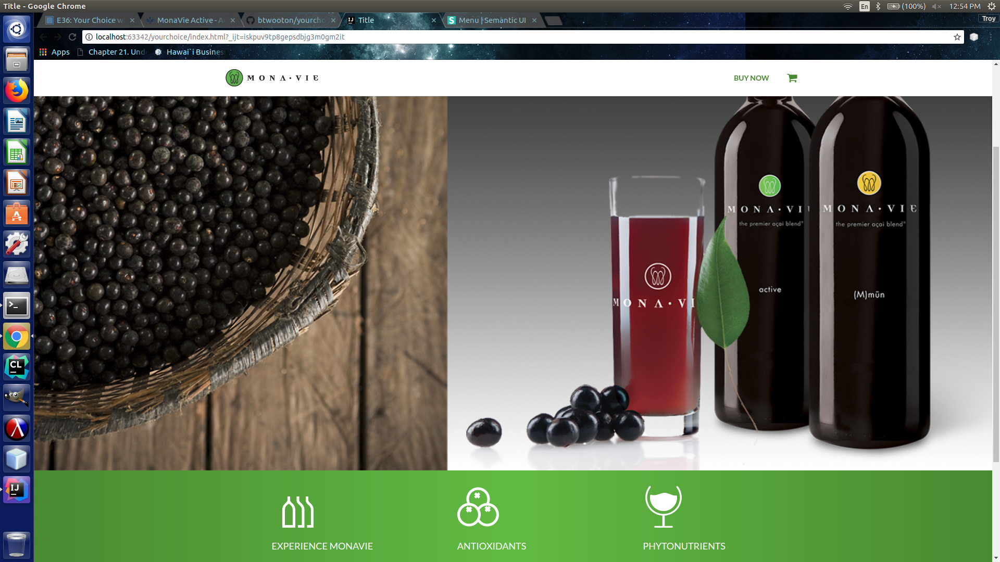

Diving into a new UI Framework is more often than not a painstaking process. Semantic UI is certainly no exception. The three hour introductory course on Pluralsight left my head spinning as, like an auctioneer, Nate Taylor spun off on the seemingly countless array of elements, views, collections, and modules that come available out of the box with the Semantic UI framework. My initial forays into playing around with Semantic left me feeling slightly frustrated at first, as I was unable to elicit precisely why my mock-ups, despite my best efforts, seemed to always fall just short of the target design.

Rocky first impressions aside, after becoming more comfortable with Semantic UI over the past week, I must say that in stark contrast to using vanilla CSS to style a page, Semantic has astonished me in the way that it empowers me to churn out a professional looking user interface by simply wrapping my HTML elements in specialized divs, and tossing in a few quick and dirty UI class declarations. This has freed me from the cognitive tedium of having to memorize the multitudinous CSS properties and values that must be used to style an element with vanilla CSS, and instead focus my mental energy on the higher level design.

Reverse engineering the UI of the <a href="https://github.com/btwooton/yourchoice">MonaVie website</a> in Semantic proved to be a joy, as I was amazed at how quickly I was able to generate a mock-up that looks reasonably close to the original. Semantic makes it dead simple to piece together, position, and style menus and navigation bars, something which I would struggle with endlessly were I forced to get the job done in pure HTML/CSS.
<figure>

  <figcaption style="text-align: center"><em>My mock-up of the MonaVie home page UI</em></figcaption>
</figure>

Having navigated the sharp learning curve of Semantic UI, I am excited to dive into the next step in my journey to software engineering greatness, the React framework. While I formerly considered myself utterly devoid of any design aptitude, Semantic has shown me that with the right brush in hand, even the least talented artist can paint a beautiful portrait. I am excited to see what I will be able to create once I have fully assimilated Semantic and React into my ever growing arsenal of development tools.
