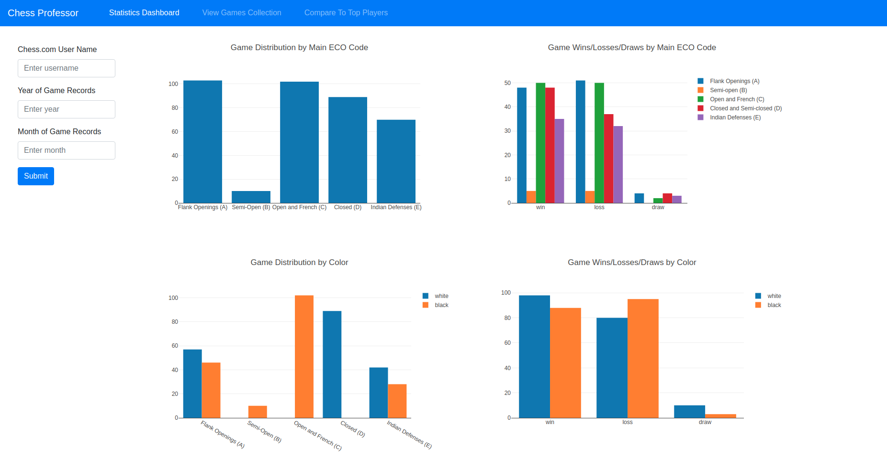
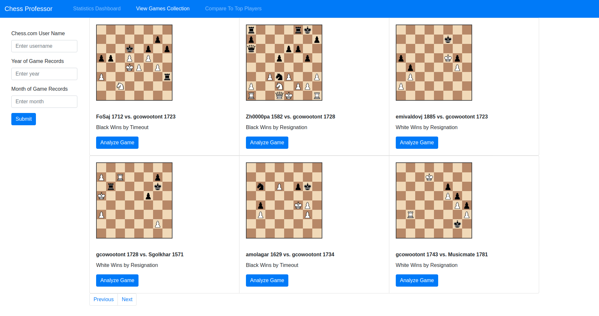
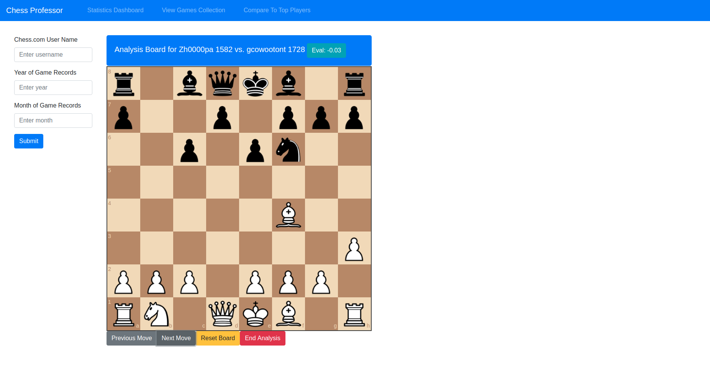
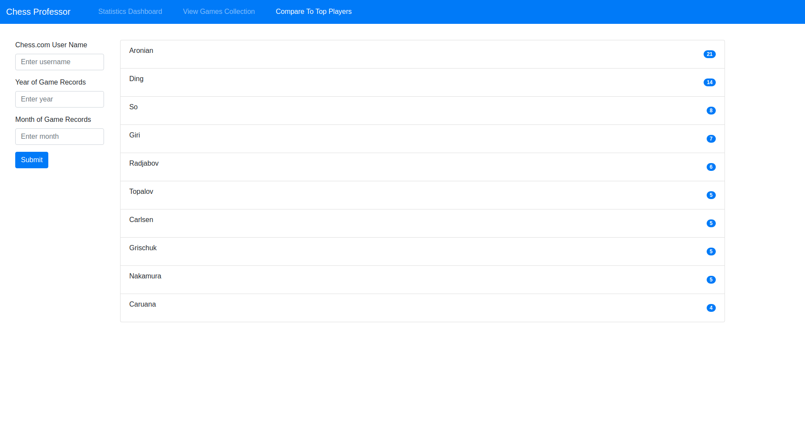

## Motivation
Chess professor attemtps to provide insights into a chess players performance trends, playing style, strengths, and weaknesses. Chess is an unfathomable deep and complex game, and it can take a lifetime to achieve a skill level close to mastery in playing chess. For this reason, chess players are often left wondering how to best navigate the complexities and subtelties of learning chess. One of the best ways to improve in chess is to analyze ones own games, and try to identify patterns that can be singled out as strengths and weaknesses in play style.

## Features
In its current iteration, Chess Professor comes with the following set of features.

### Statistics Dashboard
Once the user enters their Chess.com user name, along with a month and year for which they want to retrieve their game records, the app makes a call to the <a href="https://www.chess.com/news/view/published-data-api">Chess.com Public API</a> to fetch that players game records.
The game records are then processed to calculate a distribution of games played by <a href="https://chessopenings.com/eco/">ECO code</a>, the win/loss/draw distribution of their games by ECO Code, the ECO code distribution by playing color (black or white), and the win/loss/draw distribution by color.

These distributions are then visualized to the user in a number of bar plots on an interactive dashboard.

### Browsing the Games Collection
On a separate view, the user can browse their games collection, rendered as a group of cards showing the names and ratings of the players, the result of the game, and a chessboard displaying the final game position.

By clicking on the "Analyze Game" button for a chosen card, the user is able review the game interactively by navigating through the played moves. The user is also given access to engine analysis provided by <a href="https://github.com/nmrugg/stockfish.js/">Stockfish.js</a>

### Analyzing a Game
The analysis board allows the user to navigate backwards and forwards through the moves played in their game, while having the option of using the Stockfish chess engine to provide a numeric evaluation of each position.

In later iterations of this tool, I am planning to incorporate different insights into the game review functionality, such as highlighting specific moves as good moves, brilliancies, blunders, book-lines, etc.

### Comparing Playstyle to Top Players
My favorite feature currently implemented in the tool is the ability for the user to see a list of ten top GM players whose play style (in-terms of game opening choice distributions) most closely resembles their own.

This is determined by calculating the KL-Divergence between the user's opening choice distribution, and those of 15 top grandmaster players whose PGN game records are imported from <a href="https://www.pgnmentor.com/files.html">PGN Mentor</a>
The KL-Divergence score is then converted into a numeric similarity score, and the ten closest maches along with their similarity score are displayed to the user in a list.

## Development
This side project was developed entirely in Javascript with the following libraries and frameworks.
- The <a href="https://mithril.js.org/index.html">Mithril</a> client-side framework.
- <a href="https://getbootstrap.com/">Bootstrap</a> for UI styling and layout.
- <a href="https://chessboardjs.com/">Chessboard JS</a> for providing interactive chess board functionaltiy.
- Data visualization and plotting using <a href="https://plotly.com/javascript/">Plotly.js</a>.
- Move generation and validation using <a href="https://github.com/jhlywa/chess.js/blob/master/README.md">Chess.js</a>.

