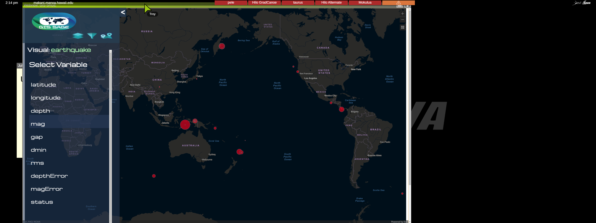

## Purpose of GIS SAGE
One of the primary benefits of the SAGE2 platform is that it seamlessly combines collaboration and visualization functionality on large display systems.

At its core, GIS SAGE is a SAGE2 native application designed to allow users to quickly import geospatial data into the SAGE2 environment and quickly create a visualization of that data by tweaking various filters and visual variables.

The user is able to drag either a .geojson, .json, or .csv file to the SAGE2 powered CyberCANOE, and an interactive basemap visualizing the respective geospatial data will appear on the wall. Once the data is loaded on the wall, the user may manipulate the appearance of the layer that is rendering the data, for example, by sizing lat-long points corresponding to earthquake events by magnitude, and coloring them by depth. 

## Development
The development of GIS SAGE was done entirely in HTML, CSS, and Javascript, leveraging the <a href="https://developers.arcgis.com/javascript/>"Esri ArcGIS javascript API</a> for all mapping and visualizaiton functionality. The <a href="http://sage2.sagecommons.org/wp-content/api/">SAGE2 application API</a> was used to develop this as a SAGE2 integrated plugin, that has been published to the <a href="http://apps.sagecommons.org/">SAGE2 Appstore</a>.

## Future Directions
While the plugin in its current form is fairly feature rich, there is still a lot that can be added to this application in terms of supporting more data formats (.shp files etc.), making the code base more modular (by using a front-end framework such as React or mithirljs), and by adding interfaces to support the integration with other mapping tools such as kepler.gl. The source code in its current form is available <a href="https://github.com/btwooton/GISSAGE">on Github</a>
