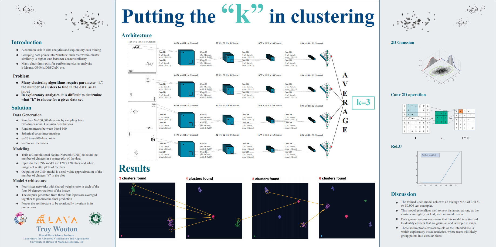
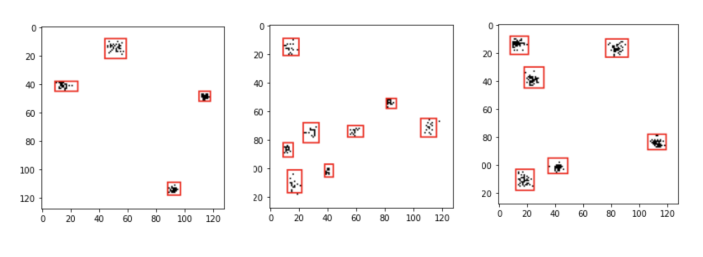
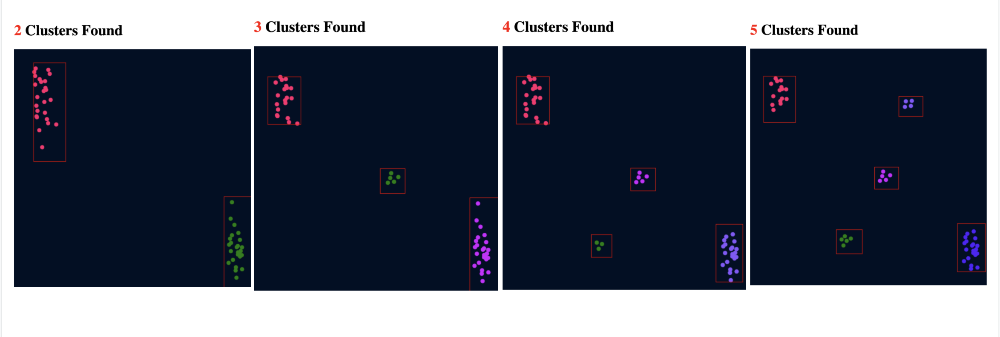
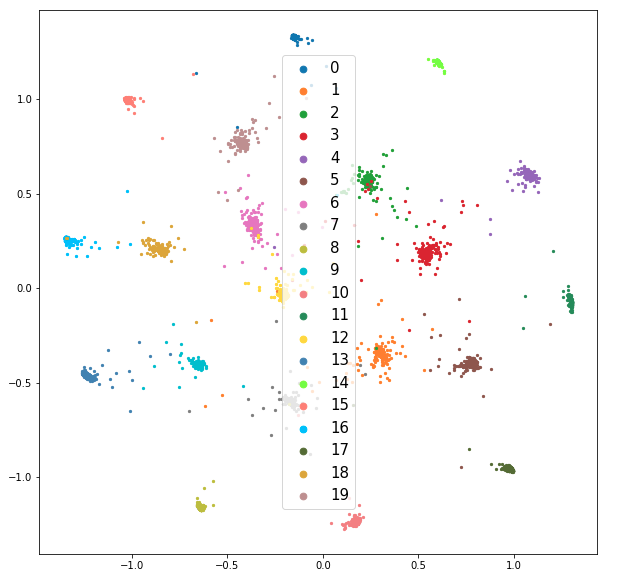
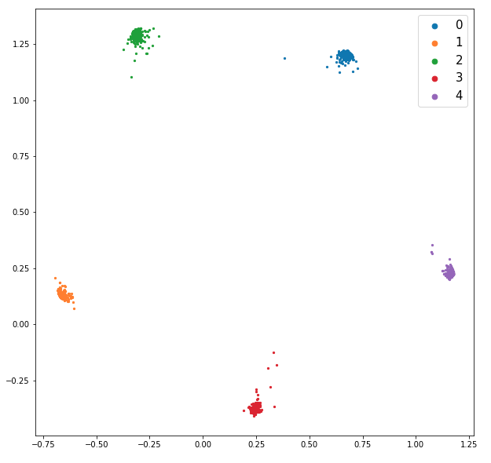

## Overview
For my masters thesis, I am exploring the application of deep learning models to enable domain exports to explore highly dimensional data points,
and interactively steer these models to learn data driven relationships between these data points from a user's interactions. By allowing the user
to steer the AI in an intuitive way, and train the AI to mimic their own human mental model of how the data are related, further explorations and queries
into the data domain of interest can be guided and fine tuned based on constraints and relationships imposed by the user.

## Components
This human in the loop machine learning approach can be subdivided into two primary components

### A Cluster Observer Model

A convolutional neural network (CNN) is trained to automatically detect clusters within an interactive scatter-plot. This scatter-plot acts as a visual representation of data that has been compressed from some arbitrary highly-dimensional representation to a 2D visual representation (via any reasonable dimensionality reduction algorithm) that can be readily interpreted by the user/analyst. In the 2D embedding space, data points that are similar to one another in high-D space should land close to one another in the 2D representation, close enough that groups of similar points will form distinct clusters. An image of this plot is passed to the cluster observer, which can automatically identify those clusters within this plot (assuming that the clusters are more or less non-overlapping 2D Gaussian distributions of points; e.g. each cluster of points is assumed to have been sampled from a 2D gaussian; k-clusters = k-Gaussians). 

A conference poster presented at the <a href="http://datascience.hawaii.edu/">Hawaii Data Science Institute</a> summarizes the initial version of this cluster observer model, which began as a 4-fold siamese CNN architecture that merely counted the number of clusters in the plot, but that has since evolved into leveraging a YOLO model to actually draw bounding boxes around clusters.

The performance of the current YOLO architecture is best summarized by the following pictures.

<figure>
  

    
  

  <figcaption><em>The stripped-down representation that the model actually sees. A white background with black dots representing data points leads to a simpler architecture with fewer parameters, without sacrificing any information.</em></figcaption>
</figure>

<figure>
  

    
  

  <figcaption><em>The User-Facing visual representation that the user sees. These are screen-shots from an interactive scatterplot demo application that I wrote to test the model. The user can drag points around within the visual representation, and the cluster observer will automatically detect the clusters. No separate clustering algorithm is needed.</em></figcaption>
</figure>

### A Clustering, Contrastive Deep Learning Model
This model uses known class labels (or cluster labels given by the cluster observer) to steer the embedding space so that points within the same class (which should ideally have similar high-D representations) cluster close together in 2D space.
This model employs a contrastive loss function, which is trained on pairs of points, such that points in the same class will form distinct clusters within the 2D embedding space, while points from different classes will be spread further apart from one another.
The initial result of training this model on the 20newsgroups and BBC News Article data sets are shown in the following two figures.

<figure>
  

    
    
  

  <figcaption><em>Results of training the contrastive Deep Neural network on the 20newsgroups and BBC News Articles Data sets.</em></figcaption>
</figure>

## Prototype Visual Analytics Tool
To demonstrate the unification of these two components, I developed a prototype visual analytics tool which allows a user to interactively explore the
<a href="https://www.kaggle.com/yufengdev/bbc-fulltext-and-category">BBC News Articles</a> dataset using an interactive scatter plot that allows the user
to steer the latent space by positioning and grouping 2D-points (representing articles) together based on how they think these articles relate to one another.
<img class="ui huge centered rounded image" src="../images/thesis_prototype.png"
Thus far, the prototype has demonstrated that these models are able to generate a tightly clustered latent representation of the data, and remain flexible
to the user's own decisions regarding how many clusters to partition the data into, and which datapoints should belong in which cluster.

