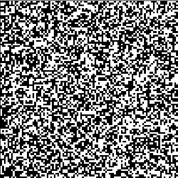

RandomMap is a random map generator that is implemented in Javascript and HTML5 canvas. I made this project as a way to learn more about cellular automata, and how they can be applied to generating randomized, 2D environments that can be used in games. The map generator works by randomly seeding the environment with terrain, applying a cellular automata rule to coalesce the terrain into aggregate clusters, and finally coloring the terrain based on location.

The specific cellular automata rule utilized in the aggregation phase is known as the 4-5 rule. Essentially, the map is divided into a 2D array of squares. All squares start out empty (white) and are then filled with terrain (colored black) with a certain probability. The 4-5 rule is then applied: a square is filled with terrain if it was filled during the seeding phase, and 4 or more of its 8 neighbors were also filled, or if it was not filled and 5 or more of its neighbors were. Hence the name 4-5 rule.

I find cellular automata rules intriguing, as they are simple and elegant to define, and yet from a finite set of rules, can give rise to a wide variety of complex patterns. Perhaps most intriguing is the existence of a class of cellular automata that have been shown to be computationially universal, able to simulate a turing machine, and thus considered turing complete. As an artifact of my background studies in marine biology, I find myself drawn to cellular automata for their potential to model biological processes, such as changes in the distribution and composition of coral reefs. Exploring applications of cellular automata is one subject that I will consider pursuing for a master's thesis.

Source: <a href="https://github.com/btwooton/RandomMap"><i class="large github icon"></i>RandomMap</a>
