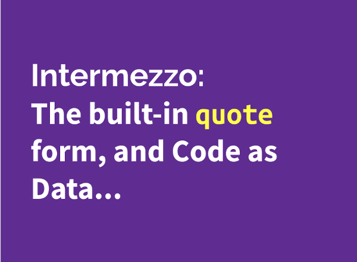

At the start of Fall 2017 semester, I took it upon myself to hold a workshop to introduce people to the Scheme programming language. The primary purpose of this workshop was to educate individuals who were looking to join the Shaka Scheme project, but was also left open to anybody who was interested in learning to program in Scheme. I prepared a series of 11 modules, along with code examples and exercises, encompassing a wide range of topics.

Topics covered in the modules included datatypes, simple expressions, recursion, lists, closures, state, abstraction, and macros. Seven people attended the workshop, and I received positive feedback from attendees, who felt that the workshop was beneficial in that it gave them a fairly comprehensive exposure to the language in a short amount of time.

Hosting this workshop was a great learning experience for me, as it was the first time I have ever given a technical talk related to programming. I learned that I need to find creative ways to relate an esoteric language like Scheme to other programming languages/concepts that audience members might have had prior exposure to in order to keep them engaged. While I found that I got very anxious and nervous in the days leading up to the workshop, it turned out to be a positive experience in that it allowed me to share my love of functional programming, and the Scheme programming language.



One of my favorite features of the Scheme programming language, that I feel grants it a great deal of power over other languages, is its ability to treat source code as data. The Scheme language comes with a built in procedure called quote that allows programmers to defer the evaluation of Scheme expressions until a later time. Quoted expressions can be passed to procedures, returned from procedures as values, and placed in complex data structures. This ability to treat code as data arises directly from the fact that Scheme exhibits homoiconicity; the syntax for code is identical to the syntax for data. To put it another way, the structure of a Scheme program can be inferred directly from its syntax.

``` scheme
  (define square (lambda (x) (* x x)))
  (define a (quote (square 5)))
  (eval a) => 25
```

In the above example, we see that by quoting the call to `(square 5)`, we were able to defer its evaluation to a later time. This allowed us to save that code as a variable with `(define a ...)`, and subsequently call the `(eval ...)` procedure on that variable to produce the result of 25. If you are interested in exploring the other modules of this workshop, follow the link below.

Source: <a href="https://github.com/btwooton/scheme-workshop"><i class="large github icon"></i>Scheme Workshop</a>
