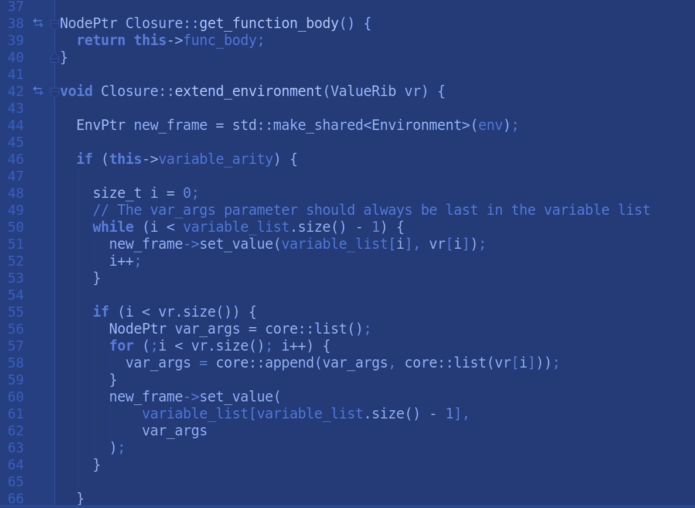

Shaka Scheme is a student driven software development project, the goal of which is to design and implement an interpreter for the Scheme programming language, conformant to the <a href="https://bitbucket.org/cowan/r7rs-wg1-infra/src/default/R7RSHomePage.md?fileviewer=file-view-default"> R7RS standard.</a> Shaka Scheme, once completed, will be the only Scheme implementation developed entirely in C++, using modern C++11/C++14 idioms. One of the motivating factors behind this undertaking is to provide a model code-base and learning tool for novice/intermediate software engineers who are interested in programming language design and implementation.

I have been team leader and lead developer of the core systems task group since I joined this project in Spring 2017. My primary development tasks and accomplishments have included the following:

<ul>
  <li>Implementing the base classes for numeric data types, including the initial scaffolding for the <a href="https://en.wikipedia.org/wiki/Numerical_tower">full numeric tower</a> required by R7RS.</li>
  <li>Implementing a Heap Virtual Machine as the core evaluation machine driving the interpreter.</li>
  <li>Implementing core language constructs including stack frames, closures, and first-class continuations.</li>
  <li>Overseeing development of the compiler which complements the VM as part of the evaluation mechanism.</li>
  <li>Implementing numerical standard library procedures, including transcendental trigonometric and logarithmic functions.</li>
</ul>

By participating in this project, I have learned a variety of software development idioms and best practices including object oriented design, test-driven development, source control management, and agile software development. This project has taught me a lot about how programming languages are implemented, and has provided me with the inspiration to pursue other language implementation projects in the future.

Source: <a href="https://github.com/uhmanoa-transpiler-project/shaka-scheme"><i class="large github icon"></i>UH Manoa Transpiler Project</a>

