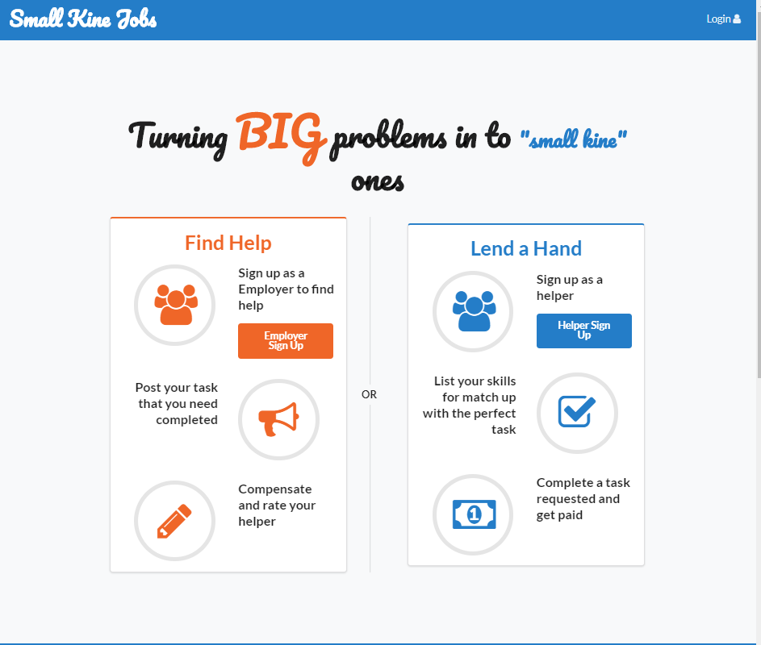
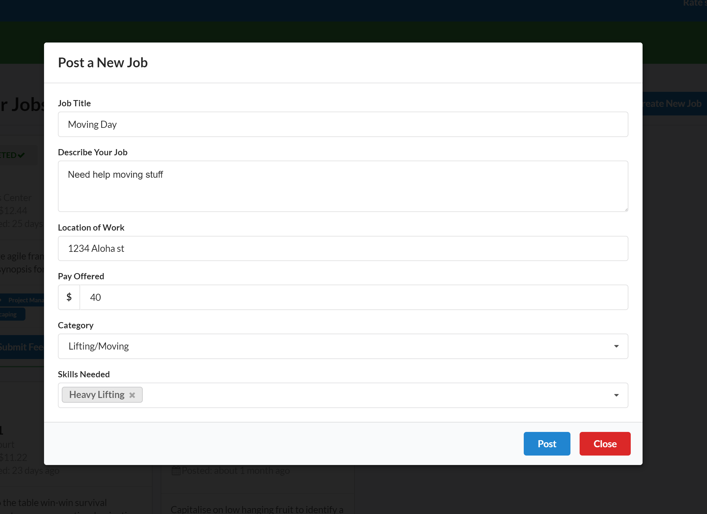
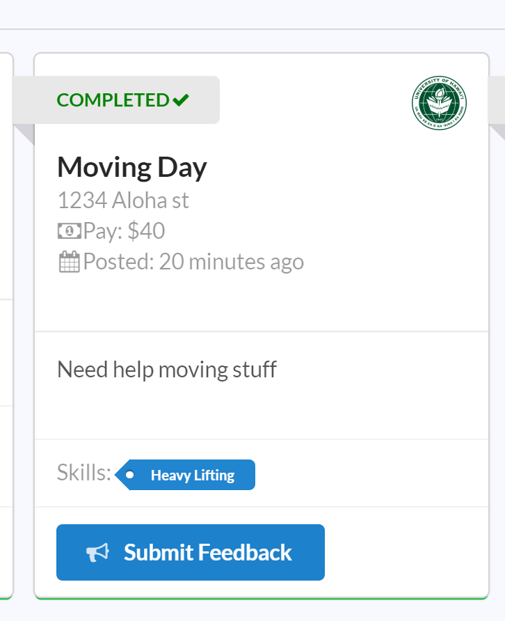
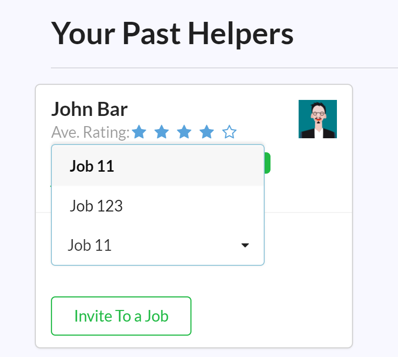
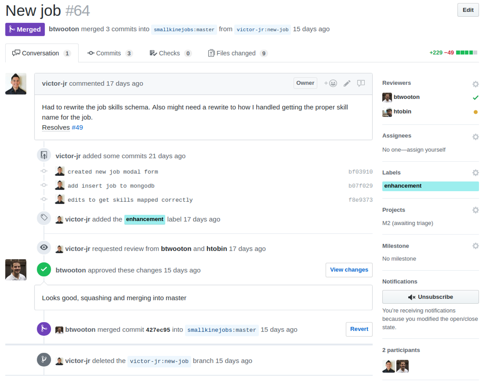

## Purpose of Small Kine Jobs
It is no secret that a majority of university students could benefit from a convenient means of making some extra income. Whether to help pay for education related expenses, food, rent, or the occasional much needed leisure, having access to quick cash can go a long way towards easing the financial burdens associated with college life. Students at the University of Hawaii are certainly no exception to this, which is why <a href="https://victor-jr.github.io/">Victor Garcia</a>, <a href="https://htobin.github.io/">Hoku Tobin</a> and I decided to create Small Kine Jobs!

At its core, Small Kine Jobs is a platform designed to enable UH students to find short term job opportunities on campus. Many students have schedules that are too packed to accomodate a conventional full-time/part-time on-campus job. Others are only at the university for a semester or two. These students can surely benefit from having access to short-term jobs that last for only a few hours to a few days.

The Small Kine Jobs platform allows University of Hawaii affiliated employers to post openings and opportunities for temporary student workers. Employers need only provide a brief description of the job, along with hourly pay and required skills, and with the push of a button their job is added to the collection of open jobs, ready to be applied to by eager students. Prospective student employees can sign up, create a profile, list their skills, and instantly receive recommendations for job openings to apply to that match their current skill set. In this way, the Small Kine Jobs application facilitates rapid interaction between UH employers looking for temporary labor, and UH students who are looking to make a quick buck.

## Development
I would say that my contributions to the project fell into two broad categories: writing code to implement a number of the complex features provided by the application, and coaching my teammates towards a standard means of commiting new features to the master branch of the application repository.

In terms of the actual code that I wrote, the majority of my time was spent brainstorming, designing, and implementing the numerous MongoDB collections that form the back-end model of the Small Kine Jobs system. The collections that I designed and implemented were Jobs, Job Categories, Skills, Users and Ratings. Implementing these collections allowed me to learn more about how MongoDB is integrated into the Meteor application framework, and how the Publish and Subscribe pattern utilized by Meteor grants developers full control over how data flows between the client and server.

In addition to model development, I also reached into the UI side of the application a few times, aiding in the implementation of features such as: a feedback button and modal that allows employees and employers to rate each other after completing a job, a button that allows employees to mark any of their in-progress jobs as completed, and an invite functionality that allows employers to invite their past helpers to new jobs that they need to fill. 
<figure>
  

    
      
  

  <figcaption><em>A couple of the UI features that I implemented with React Semantic UI</em></figcaption>
</figure>
Working on both the UI and the back-end of the application was a lot of fun. I was able to gain a deeper understanding of how data is passed through the various React components that make up the overall application, and how complex interactions between these components can be achieved via the use of a few simple Javascript callback functions.

## Project Experience
Aside from writing code, my second major contribution to the project came in the form of my ability to share my knowledge of some git best practices. I was able to teach both of my teammates to use GitHub's pull request system to issue their new features to the application repository. I find pull requests to be a more robust and worry-free way to manage the development of new features than simple git branching/merging, which can lead to rampant merge conflicts. I walked them through forking the repo, setting up their remotes for pushing and fetching, and coached them on performing frequent rebases from the master branch to avoid merge conflicts. In doing so, not only was I able to teach them valuable skills that they will be able to apply in the future, but I also reinforced and deepened my own knowledge of git, GitHub, and version control.
<figure>
  
  <figcaption><em>The pull request system is also integrates well with GitHub's issue tracker</em></figcaption>
</figure>
Overall, I would say that my experience working on this project with my teammates was a positive one. I was able to gain valuable experience working with a small, tight-knit team of programmers to develop a non-trivial web application using a plethora of modern development tools. I was able to see how IDEs such as IntelliJ, code quality tools like ESLint, version control systems like GitHub, and application frameworks like Meteor can be leveraged simultaneously to facilitate the rapid development of complex systems that can continue to scale to meet changing software requirements.

If you are interested in potentially contributing to the development of Small Kine Jobs, or are simply curious and would like to learn more about the project, <a href="https://smallkinejobs.github.io">head on over to our organization's GitHub page for a visit!</a>
