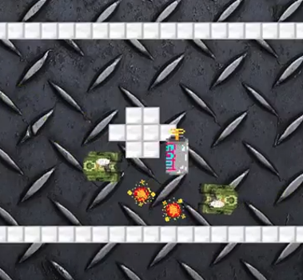

World of War TankZ is a 2D, top-down perspective, two player tank battle arena game. Players are pitted against one another in a sudden death bout. The first player to bring their opponent's health points down to zero wins the game. This game features projectile physics allowing for bullets to ricochet off of obstacles and walls. Randomized power ups are generated at set intervals within the arena, including weapon upgrades, shields, med-kits, and speed boosts.

In this project, my role was to design and implement the tank mechanics, projectiles, physics, and power up mechanics. The most challenging aspect in coding up the game logic for this project was figuring out how to get the projectile physics to work such that projectiles could richochet off of any obstacle on the map.

This project taught me how to design a game that has balanced gameplay mechanics, which turned out to be more challenging than actually writing the code to implement the game. I also learned how to apply the concepts of OOP, collision detection, managing game objects with uniform interfaces, and randomization in a slightly more complex project than I had done previously. Additionally, I learned how to work with a team of developers towards a common goal, and how to cope with differing work habits and coding styles.

A gameplay sample of this project can be viewed at the <a href="https://github.com/d-k-k/EZ/wiki/Programs-made-by-students-with-EZ">EZ Java project page</a>

Source: <a href="https://github.com/btwooton/WorldOfWarTankZ"><i class="large github icon"></i>World of War TankZ</a>

